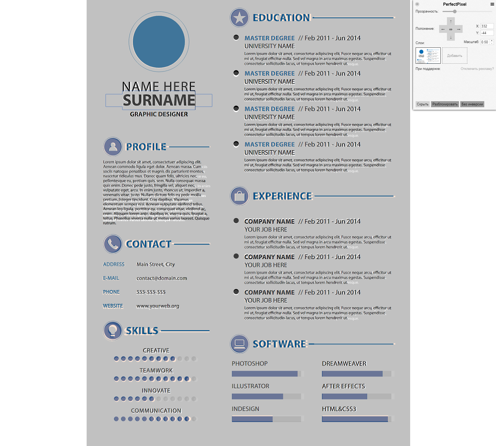

<h1>Curriculum Vitae</h1> 
<h2>a simple template for a web developer's resume</h2> 

demo:
<a href="https://alextsk.github.io/cv-markup/">https://alextsk.github.io/cv-markup/</a>
<h3>Hot to use it:</h3>
<ol>
  <li>
    copy a project  
    <code>git clone https://github.com/alextsk/cv-markup.git</code> 
  </li>
  <li>
  install dependencies: run 
    
<code>yarn install</code>
 
    or 
    
<code>npm install</code>
 
    from inside the project's folder
  </li>
  <li>
    to run the project write 
    

      <code>
        gulp
      </code>
    

      or, if gulp-cli is not installed globally
     

      <code>
        npm run serve
      </code>
    

  </li>
  <li>
    to build without running  
    

      <code>
        gulp build
      </code>
    

    or, if gulp-cli is not installed globally
     

      <code>
        npm run build
      </code>
    

  </li>
</ol>
 

